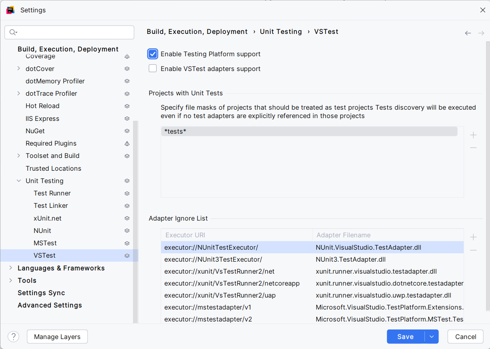
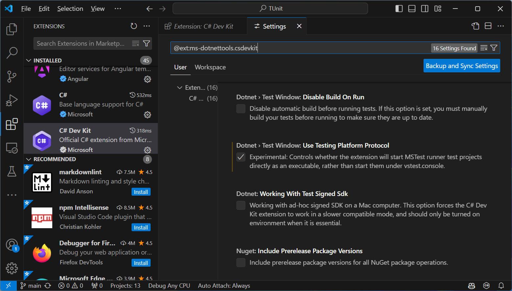

# Running your tests

As TUnit is built on-top of the newer Microsoft.Testing.Platform, and combined with the fact that TUnit tests are source generated, running your tests is available in a variety of ways. 

## [dotnet run](https://learn.microsoft.com/en-us/dotnet/core/tools/dotnet-run)

For a simple execution of a project, `dotnet run` is the preferred method, allowing easier passing in of command line flags.

```powershell
cd 'C:/Your/Test/Directory'
dotnet run -c Release --report-trx --coverage
```

## [dotnet test](https://learn.microsoft.com/en-us/dotnet/core/tools/dotnet-test)

`dotnet test` requires any command line flags to be specified as application arguments, meaning after a `--` - Otherwise you'll get an error about unknown switches.

```powershell
cd 'C:/Your/Test/Directory'
dotnet test -c Release -- --report-trx --coverage
```

## [dotnet exec](https://learn.microsoft.com/en-us/dotnet/core/tools/dotnet)

If your test project has already been built, you can use `dotnet exec` or just `dotnet` with the `.dll` path

```powershell
cd 'C:/Your/Test/Directory/bin/Release/net8.0'
dotnet exec YourTestProject.dll --report-trx --coverage
```

or

```powershell
cd 'C:/Your/Test/Directory/bin/Release/net8.0'
dotnet YourTestProject.dll --report-trx --coverage
```

## Published Test Project

When you publish your test project, you'll be given an executable.
On windows this'll be a `.exe` and on Linux/MacOS there'll be no extension.

This can be invoked directly and passed any flags.

```powershell
cd 'C:/Your/Test/Directory/bin/Release/net8.0/win-x64/publish'
./YourTestProject.exe --report-trx --coverage
```

# IDE Support

## Visual Studio
Visual Studio is supported on the Preview version currently. 

- Install the [latest preview version](https://visualstudio.microsoft.com/vs/preview/)
- Open Visual Studio and go to Tools > Manage Preview Features
- Enable "Use testing platform server mode"


## Rider
Rider is supported. 

The [Enable Testing Platform support](https://www.jetbrains.com/help/rider/Reference__Options__Tools__Unit_Testing__VSTest.html) option must be selected in Settings > Build, Execution, Deployment > Unit Testing > VSTest.



## VS Code
Visual Studio Code is supported.

- Install the extension Name: [C# Dev Kit](https://marketplace.visualstudio.com/items?itemName=ms-dotnettools.csdevkit)
- Go to the C# Dev Kit extension's settings
- Enable Dotnet > Test Window > Use Testing Platform Protocol

